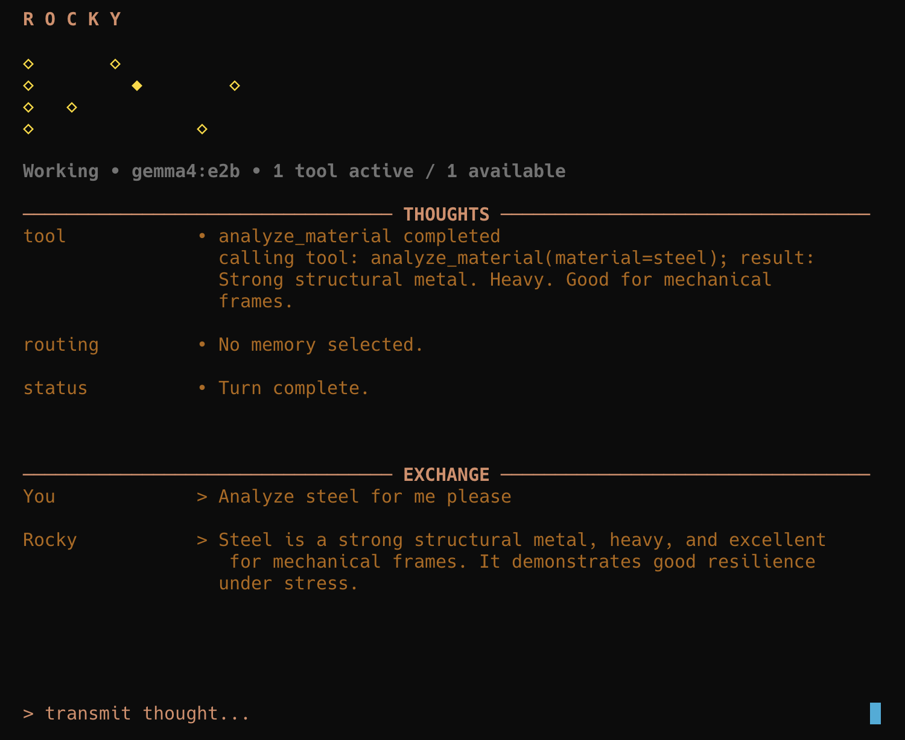

# Project Rocky Agent



This project is created for **learning and experimenting with various AI agent concepts** including persona based AI agents, cognitive architectures, multi-layered memory systems, and localized reasoning loops.

## What Rocky Does

- Runs in a curses-based terminal UI.
- Keeps a live internal monologue stream for routing, memory loading, tool activity, and reasoning updates.
- Uses separate memory paths for:
  - semantic memory: durable Markdown-backed notes
  - episodic memory: compacted conversation summaries and excerpts
- Routes memory selectively so Rocky does not search memory on low-signal turns like acknowledgements or "no thanks".
- Supports tool calling through the configured tool registry.

## Getting Started

1. **Install dependencies**:

   ```bash
   poetry install
   ```

2. **Run the bootstrap setup**:
   This will automatically create your `.env`, initialize the database file (`rocky_memory.sqlite3`), and pull the required Ollama model:

   ```bash
   ./setup.sh
   ```

3. **Launch Rocky**:
   ```bash
   poetry run python rocky.py
   ```

## Memory Model

### Semantic Memory

Semantic memory is stored as Markdown documents with:

- a title
- content

You can ingest one file or a directory of `.md` / `.markdown` files. Every top-level `# Heading` becomes a separate semantic memory document. Content between headings stays attached to that title.

Example:

```md
# Rocky's origin

Rocky comes from the Hail-Mary class and studies materials engineering.

# Rocky's expertise

Rocky prefers practical recommendations and tradeoff-based reasoning.
```

### Episodic Memory

Episodic memory stores compacted conversation summaries and excerpts. It is used for prior-session and earlier-turn recall when the router decides the query needs it.

## TUI Commands

Inside the Rocky TUI, you can use the following slash commands:

- `/memory <text>`: Quick-store a semantic memory.
- `/memory <title> :: <content>`: Store a semantic memory with a specific title and content.
- `/memory search <title>`: Show the full stored semantic memory for a title.
- `/memory list [semantic|episodic] [n]`: List stored memories (defaults to semantic).
- `/memory delete [semantic|episodic] [selector]`: Delete a specific memory by index or title.
- `/memory delete all [semantic|episodic|all]`: Bulk delete memories.
- `/compact`: Manually force compaction of the current dialogue into episodic and semantic memory.
- `/tools`: List all tools currently available to Rocky.
- `/clear`: Clear the visible conversation history from the TUI (does not delete memory).
- `/reset`: Full session reset—wipes episodic memory and session snapshots while preserving semantic memory.
- `/help`: Show available commands and их usage.
- `/quit` or `/exit`: Exit the Rocky session.

## External CLI Commands

You can also manage Rocky's memory directly from your terminal without entering the TUI:

- **Ingest Markdown**: Import one or more files/directories as semantic memory:
  ```bash
  python rocky.py ingest datasets/semantic-memories.md
  ```
- **List Semantic Titles**:
  ```bash
  python rocky.py memory list [limit]
  ```
- **Search a Semantic Memory by Title**:
  ```bash
  python rocky.py memory search "User"
  ```

## Project Structure

```text
rocky/
├── rocky.py          # CLI entry point (Ingest / Memory management)
├── rocky/            # Core package
│   ├── agent.py      # Agent orchestration and turn execution logic
│   ├── config.py     # Configuration and environment loading
│   ├── conversation.py
│   ├── events.py     # Event-driven TUI updates
│   ├── llm.py        # Provider-agnostic LLM interface (Ollama/OpenAI)
│   ├── memory/       # SQLite persistence and memory manager
│   ├── prompts/      # Externalized system and memory prompts
│   ├── session.py    # UI-facing session state management
│   ├── tools/        # Tool registration and execution
│   └── tui/          # Curses-based terminal interface
├── datasets/         # Example semantic memory Markdown files
└── pyproject.toml    # Dependencies and package metadata
```

## Notes

- **Memory Routing**: Rocky doesn't just search memory every turn; he uses a router to decide when past context is actually needed for the current query.
- **Compaction**: Dialogue is automatically compacted into episodic and semantic memory every few turns, but you can trigger this manually with `/compact`.
- **Durable Storage**: Semantic memory (notes/facts) is persisted across all sessions, while episodic memory is unique to the current interaction timeline.
